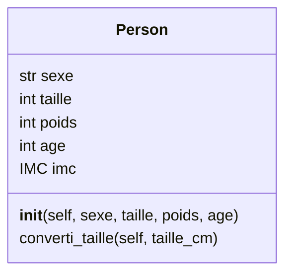
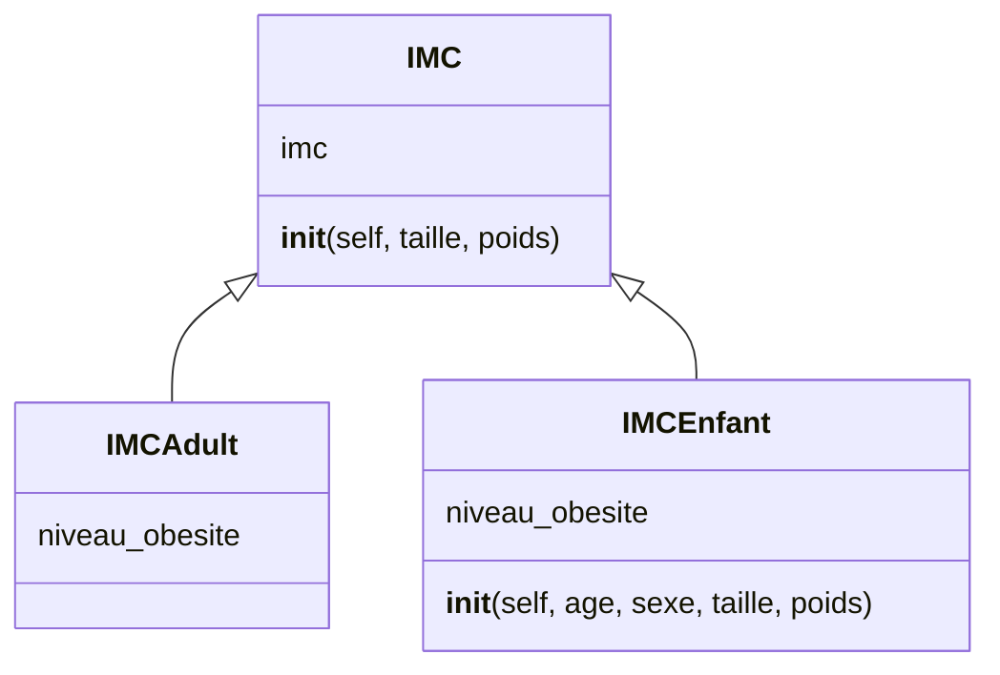

# Calcul de l'IMC

> L'objectif d'obtenir un tableau précisant
> 
> - les personnes
>   
> - leur IMC
>   
> - l'interpretation de cette IMC
>   

## Consigne

Vous allez développer un programme en python qui :

- Lira le contenu d'un fichier csv contenant la liste des personnes
  
- Calculera l'imc pour chaque individu
  
- Précisera l'interpretation du calcul
  
- Affichera un tableau contenant toutes les informations
  

Il est mis a votre disposition le squellette du projet disponible [ici](https://github.com/AzzouzMezlini/TP_python_POO)

Il contient :

- les fichiers pour développer les classes
  
  - `Person.py` pour développer la classe
    
    - Person
  - `IMC.py` pour développer les classes
    
    - IMC
      
    - IMCAdult
      
    - IMCEnfant
      
- Un fichier contenant une fonction qui convertie un fichier csv en tableau
  
  - `read_csv/__init__.py`
- Les fichier CSV contenant les données a traiter
  
  - `data/imc_adulte.csv`
    
  - `data/imc_enfant_F.csv`
    
  - `data/imc_enfant_G.csv`
    
  - `data/liste_personne.csv`
    

## Classes a utiliser

Le TP est a réaliser selon le paradigme de la programmation orienté objet *(POO)*.

Voici le diagramme des classes attendues

## Calcul de l'IMC

L'IMC est l'indice de corpulence exprimé en `kg/m²`

La formule de calcul de l'IMC est :

$$
poids(kg) / taille ^ 2(m)
$$

## Getter & Setter

Il vous appartient d'identifier quel getter et setter utiliser.

# Classe abstraite

La classe IMC est une classe abstraite

## Extrait des fichiers

### Liste de personnes

| Gender | Height | Weight | age |
| --- | --- | --- | --- |
| Male | 174 | 96  | 37  |
| Male | 189 | 87  | 36  |
| Female | 185 | 110 | 6   |

### Les des IMC des adultes

| min | max | Interprétation |
| --- | --- | --- |
|     | 16.5 | famine |
| 16.5 | 18.5 | maigreur |
| 18.5 | 25  | corpulence normale |
| 25  | 30  | surpoids |
| 30  | 35  | obésité modérée |
| 35  | 40  | obésité sévère |
| 40  |     | obésité massive |

### Liste des IMC des enfants

**Filles**

| Age | Surpoids_Filles | Obésité_Filles |
| --- | --- | --- |
| 0.0 | 14.12 | 14.81 |
| 0.5 | 17.95 | 18.85 |
| 1.0 | 18.25 | 19.22 |
| 1.5 | 18.11 | 19.13 |
| 2.0 | 17.92 | 19.03 |

**Garçons**

| Age | Surpoids_Garcons | Obésité_Garcons |
| --- | --- | --- |
| 0.0 | 14.28 | 15.01 |
| 0.5 | 18.66 | 19.72 |
| 1.0 | 18.73 | 19.81 |
| 1.5 | 18.37 | 19.87 |
| 2.0 | 18.05 | 19.14 |
